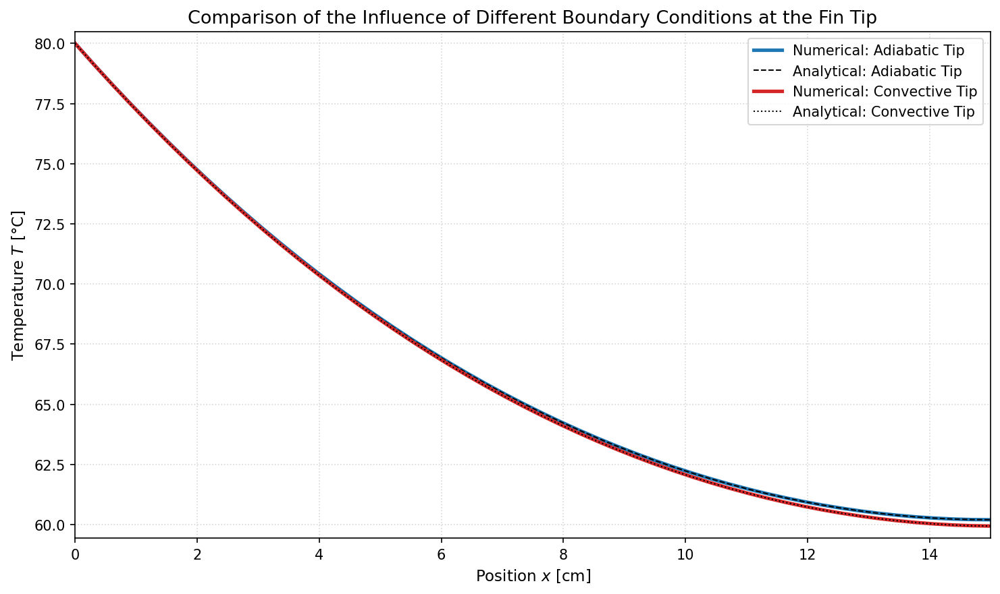
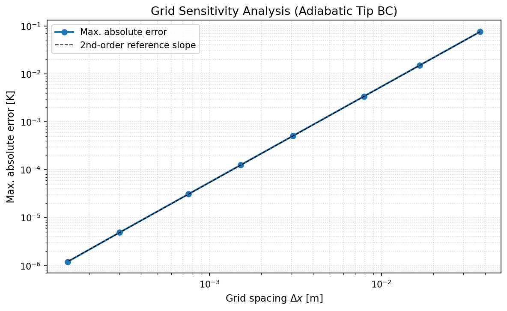

# 1D Cooling Fin Temperature Profile Simulation

Numerical simulation of the steady-state temperature distribution along a rectangular cooling fin using the **Finite Difference Method (FDM)**, validated against the analytical solution from the VDI Heat Atlas. The convective heat transfer coefficient is derived analytically from flow conditions using flat-plate boundary layer theory.

## Physical Model

The governing equation is derived from an energy balance between axial conduction and lateral convection along the fin:

$$\frac{d^2T}{dx^2} - m^2(T - T_\infty) = 0, \quad m^2 = \frac{h \cdot P}{\lambda \cdot A_c}$$

The convective coefficient $h$ is calculated from forced convection over a flat plate. Air flows at velocity $v$ from the thin edge of the fin along its length $L$, giving:

$$Re_L = \frac{v \cdot L}{\nu}, \quad Nu_L = 0.664 \cdot Re_L^{1/2} \cdot Pr^{1/3} \quad (Re_L < 5 \times 10^5)$$

$$h = \frac{Nu_L \cdot k_\text{air}}{L}$$

Air properties (dynamic viscosity, density, thermal conductivity) are evaluated at the film temperature $T_\text{film} = (T_\text{base} + T_\infty) / 2$ using Sutherland's law and power-law fits.

## Features

- **Analytical h_conv**: Convective coefficient derived from Reynolds and Nusselt number correlations — no hardcoded values
- **FDM Solver**: Tridiagonal system assembled and solved via the Thomas Algorithm (`scipy.linalg.solve_banded`)
- **Boundary Condition Comparison**: Adiabatic vs. convective (Robin) tip conditions implemented and compared
- **Analytical Validation**: Results verified against the closed-form solution from the VDI Heat Atlas
- **Grid Sensitivity Analysis**: Convergence study confirming 2nd-order accuracy of the central difference scheme

## Requirements

```
Python 3.x
numpy
scipy
matplotlib
```

## Usage

```bash
python Temperaturprofil_Kuehllamelle.py
```

Parameters can be adjusted at the top of the `__main__` block:

| Parameter     | Value     | Description                          |
|---------------|-----------|--------------------------------------|
| `length`      | 0.15 m    | Fin length (= characteristic length for flow) |
| `width`       | 0.12 m    | Fin width                            |
| `thickness`   | 0.003 m   | Fin thickness                        |
| `lam`         | 200 W/mK  | Thermal conductivity (aluminium)     |
| `v_flow`      | 2.0 m/s   | Air flow velocity                    |
| `T_base`      | 353.15 K  | Base temperature (80 °C)             |
| `T_inf`       | 300 K     | Ambient temperature (27 °C)          |

## Results

### Convective Coefficient

For the default parameters (air at 2 m/s, $T_\text{film} \approx 53\,°C$):

| Quantity | Value |
|----------|-------|
| Reynolds number $Re_L$ | 16 468 |
| Nusselt number $Nu_L$ | 75.91 |
| Convective coefficient $h$ | 14.12 W/(m²·K) |

### Temperature Distribution

The numerical solution matches the analytical reference with errors below **10⁻⁴ K** at 50 grid points. The adiabatic and Robin tip boundary conditions produce a tip temperature difference of approximately **0.16 K** under the default parameters.



### Grid Sensitivity Analysis

The log-log convergence plot confirms **2nd-order accuracy** of the FDM scheme, consistent with the central difference discretization used for both interior nodes and the Robin boundary condition.


